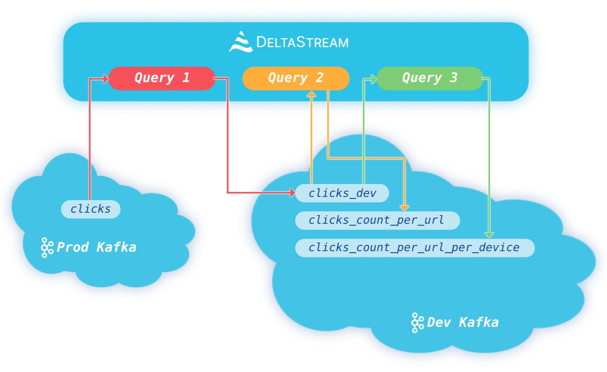

# What is DeltaStream????

DeltaStream is a serverless database to manage and process all your streams on cloud. We built DeltaStream to take away the complexity from building and operating scalable, secure and reliable real-time streaming applications and make it as easy, fast, and accessible as possible. To achieve this goal, we are bringing the tried and true benefits of relational data management to the streaming world. Relational databases have successfully been used to manage and process data at rest for the last few decades and have played a crucial role in democratizing access to data in organizations. In addition to processing capabilities, these systems also provide capabilities to organize and secure data in a familiar way. With DeltaStream, we bring not just familiar processing capabilities to the streaming world but also provide similar ways to manage and secure streaming data, a unique differentiator compared to existing solutions.

<figure><figcaption></figcaption></figure>

The following are some of the principles that DeltaStream has built upon and what makes it into a unique service:

1. **DeltaStream is serverless:** This means as a developer, data engineer, or anyone who interacts with real-time streaming data, you don’t have to provision, scale, or maintain servers or clusters to build and run your real-time applications. No need to decide how big of a deployment or how many tasks to allocate to your applications. DeltaStream takes care of all those complexities so you can focus on building your core products that bring value to you and your customers instead of worrying about managing and operating distributed stream processing infrastructure. Indeed, there is no notion of cluster or deployment in DeltaStream, and you can assume unlimited resources available for your applications while you are building them. You only pay for what you use, and DeltaStream seamlessly scales up or down your applications as needed and recovers them from any failures.
2. **Embrace SQL database model:** For the past few decades, SQL databases have proven to be a great way to manage and process data. Simplicity and ubiquity of SQL has made it easy to query and access the data. However, many real-time streaming systems either do not utilize these capabilities or only try to use them partially for expressing processing logic with SQL and ignore other capabilities, such as managing and securing access to the data. DeltaStream brings all the capabilities you know and are used to in the SQL databases for data at rest to the streaming world.
   * **SQL:** DeltaStream enables users to easily build real-time applications and pipelines with a familiar SQL dialect. From simple stateless processing, such as filtering and projections, to complex stateful processing, such as joins and aggregations that can be done in DeltaStream with a few lines of SQL. DeltaStream seamlessly provides desired delivery guarantees (exactly once or at least once), automatic checkpointing, and savepointing for elasticity and fault tolerance.
   * **Organizing your data in motion:** Similar to SQL databases, DeltaStream enables you to organize your streaming data in databases and schemas. A database is a logical grouping of schemas, and a schema is a logical grouping of objects such as streams, tables, and views. This is the basis of namespacing in DeltaStream, which enables our users to organize their data much more effectively compared to a flat namespace.
   * **Securing your data in motion:** Securing your data is one of the foundational features in DeltaStream. In addition to common security practices such as data security, authentication, and authorization, DeltaStream provides the familiar Role-based Access Control model from SQL databases that enables users to control who can access data and what operations they can perform with data. Users can define roles and grant or revoke privileges the same way they do in other SQL databases. The combination of DeltaStream’s namespacing and security capabilities provide a powerful tool for users to secure their data in motion, and this is one of the main differentiators for DeltaStream.
3. **Separation of Compute and Storage:** DeltaStream architecture separates the compute and storage, resulting in well-known benefits, such as elasticity, cost efficiency, and high availability. Additionally, DeltaStream’s model of providing the compute layer on top of users’ streaming storage systems, such as Apache Kafka or AWS Kinesis, eliminates the need for data duplication and doesn’t add unnecessary latency to real-time applications and pipelines. DeltaStream also is agnostic to the underlying storage service and can read from and write into data-in-motion storage services, such as Apache Kafka or AWS Kinesis, and data at rest storage services like AWS S3 or DataLakes. Such flexibility gives DeltaStream the capability to provide an abstraction layer on top of many storage services where users can read data from one or more services, perform desired computation, and write the results in one or more storage services seamlessly.

As a cloud service, DeltaStream provides a REST API with GraphQL. There are three ways of using the service.

1. **Web App:** The DeltaStream web app provides a browser-based application where users can interact with the service.
2. **Command Line Interface (CLI):** Users can also use the DeltaStream CLI application to interact with the service through their terminal. The CLI provides all the functionalities that the web app provides.
3. **Direct access to Rest API:** Users can directly access the service through the provided Rest API. This enables users to integrate DeltaStream into their applications or their CI/CD pipelines.
